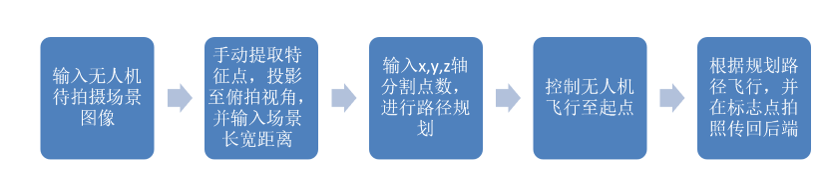

# Tello Scan
## 一、介绍
Tello Scan是一款对Tello无人机进行飞行控制和路径规划软件。可以实现Tello无人机Wifi图传，实时解码，并进行Z字形飞行路线规划。

工作流程如下所示

经Tello-Scan在固定位置拍摄得到的图片，可以应用到场景的离线三维重建任务中，重建算法使用VisualSFM + CMPMVS，最终效果如下

## 二、参考资料
[1] [Tello-Python](https://github.com/dji-sdk/Tello-Python)

**注意**：目前软件仅存在不兼容的问题，可以在python2.7下完成视频流拉取解码，但在python3时不行。在python2.7下，中央三维显示界面会不正常。路径规划功能以及控制功能在python2.7和python3下都能实现。

