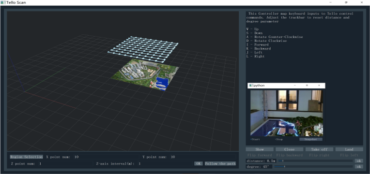

# Tello Scan
## 一、介绍
Tello Scan是一款对Tello无人机进行飞行控制和路径规划软件。可以实现Tello无人机Wifi图传，实时解码，并进行飞行路线规划。

工作流程如下所示

可以应用到场景的三维重建中，后面重建算法使用VisualSFM + CMPMVS

## 二、参考资料
[1] [tello-video](https://github.com/eclipsequote/tello_video)

## 三、注意
目前软件还存在不兼容的问题，可以在python2.7下完成视频流拉取解码，但在python3时不行。而在python2.7下，中央三维显示界面会不正常。

